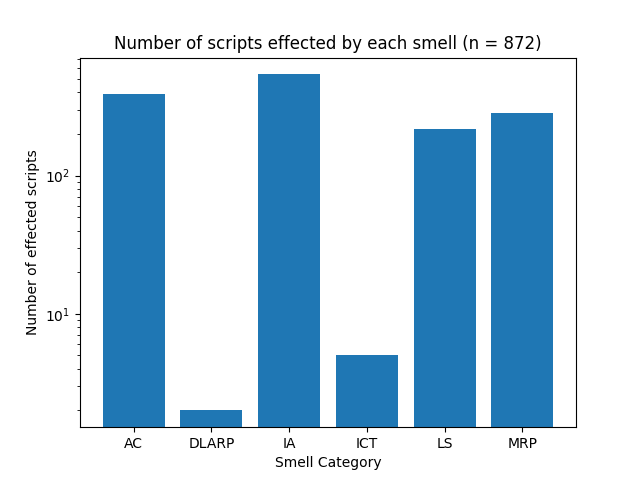
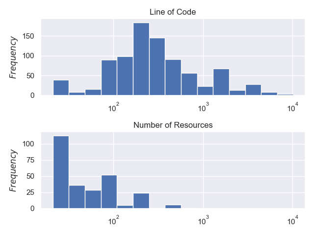
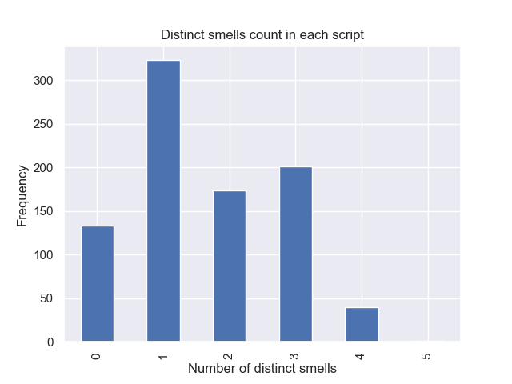
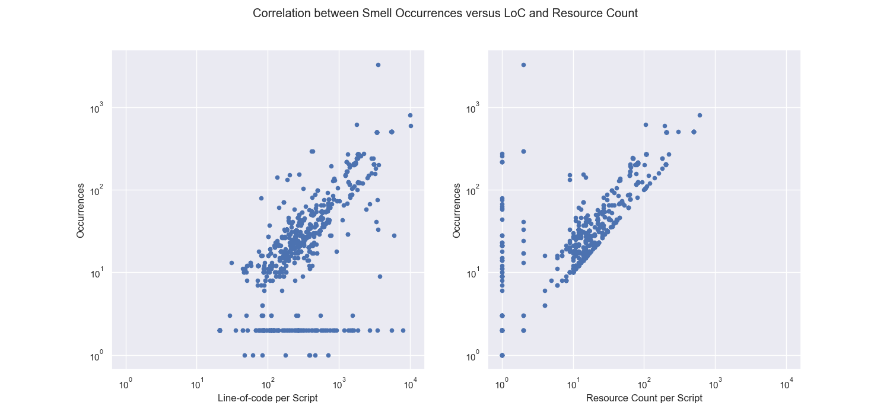
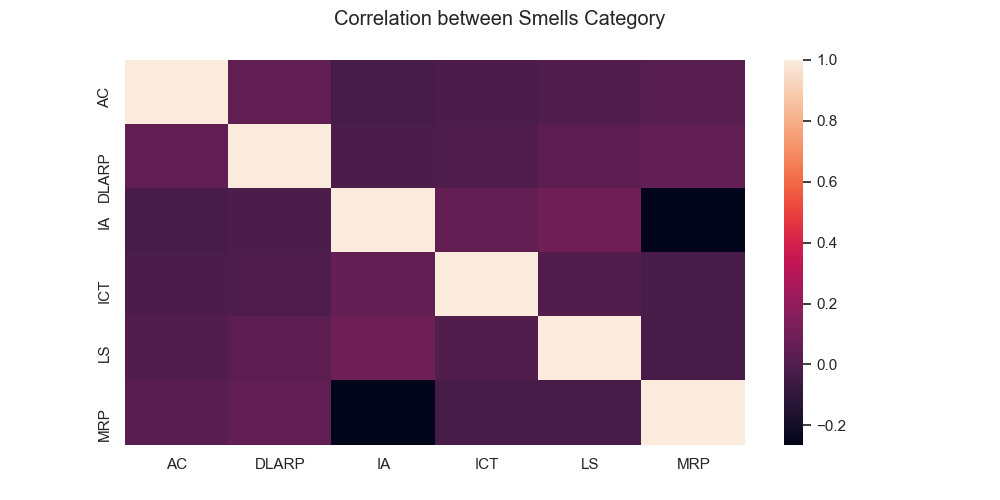
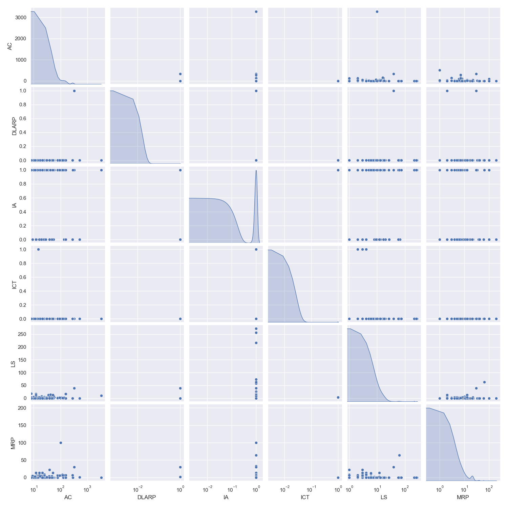

# Code Smells in Infrastructure as Code: a Kubernetes-specific study

## Result

There are currently 6 smell detectors successfully implemented. As a result from running the detection pipeline,
the number of smells instances found for each category are the following:

- Incomplete Tasks (ICT)
- Long Statements (LS)
- Avoid Comments (AC)
- Improper Alignment (IA)
- Duplicated Liveness and Readiness Probes (DLARP)
- Missing Readiness Probe (MRP)

<!-- TODO: Fix these numbers -->

| Smell Category                                   | Instances [outdated] | Scripts Effected [outdated] |
| ------------------------------------------------ | -------------------- | --------------------------- |
| Incomplete Tasks (ICT)                           | 5                    | 5                           |
| Long Statements (LS)                             | 3,255                | 217                         |
| Avoid Comments (AC)                              | 18,530               | 389                         |
| Improper Alignment (IA)                          | 540                  | 540                         |
| Duplicated Liveness and Readiness Probes (DLARP) | 3,096                | 285                         |
| Missing Readiness Probe (MRP)                    | 3,128                | 286                         |

Total line-of-code: 525,948
Total number of scripts: 872

## Occurence Visualization

## Effected Scripts Visualization

## Scripts Characteristics Visualization

The first subplot is a histogram representing the number of line-of-code for each script.
The second subplot is a histogram showing the number of Kubernetes resources per script.

## Distinct Smells per script Visualization

## Correlation Analysis

From the result we perform further analyses. The relationship between smells occurrences and
each characteristic is firstly focused.

As we can see from the left-hand side graph, it shows that there are no occurrences of infrastructural
code smells persisted for small-size scripts to some extent. Secondly, when we look at the occurrences-resource-count graph, a trend where occurrences of smells
increases as the number of resources per script grows.

Next, we are going to consider the correlation between each smell category.

# Smells Co-occurrence

