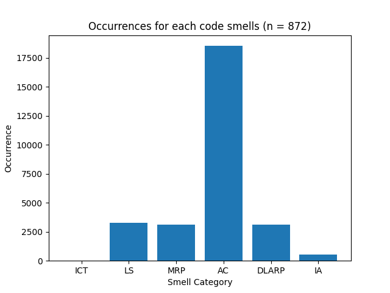
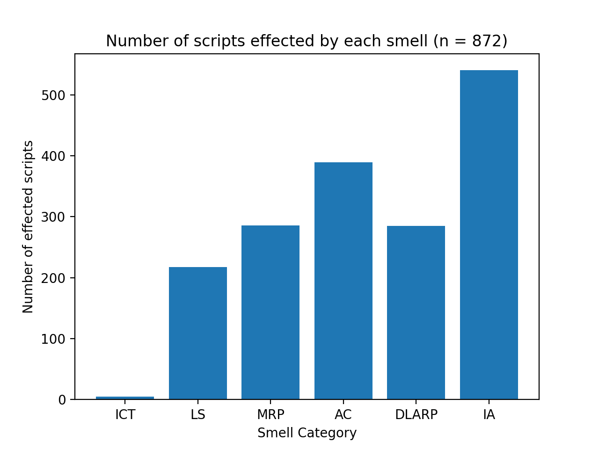

# Code Smells in Infrastructure as Code: a Kubernetes-specific study

## Result

There are currently 6 smell detectors successfully implemented. As a result from running the detection pipeline,
the number of smells instances found for each category are the following:

- Incomplete Tasks (ICT)
- Long Statements (LS)
- Avoid Comments (AC)
- Improper Alignment (IA)
- Duplicated Liveness and Readiness Probes (DLARP)
- Missing Readiness Probe (MRP)

| Smell Category                                   | Instances | Scripts Effected |
| ------------------------------------------------ | --------- | ---------------- |
| Incomplete Tasks (ICT)                           | 5         | 5                |
| Long Statements (LS)                             | 3,255     | 217              |
| Avoid Comments (AC)                              | 18,530    | 389              |
| Improper Alignment (IA)                          | 540       | 540              |
| Duplicated Liveness and Readiness Probes (DLARP) | 3,096     | 285              |
| Missing Readiness Probe (MRP)                    | 3,128     | 286              |

Total line-of-code: 525,948
Total number of scripts: 872

## Occurence Visualization

## Effected Scripts Visualization

